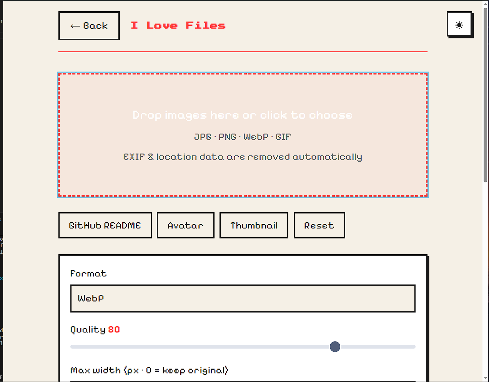

## I ♥ Files

A local image converter and compressor that runs entirely in your browser. 
URL : https://ilovefilesbyhemanth.netlify.app/



## Features

-Nothing leaves your device.
-No internet required.
-Compress,rotate,convert(JPEG,PNG,WebP,Gif)
-Light and Dark mode
-Pixel themed

## How it works?

Using canvas API it compresses your images to the desired quality using binary search.

## Architecture 
This is generated using file structure commands.

```
 ILoveFiles
├── .vscode
│   └── settings.json
├── README.md
├── css
│   └── style.css
├── icons
│   ├── favicon.png
│   └── heart.png
├── images
│   └── screenshot1.png
├── index.html
├── js
│   ├── action.js
│   ├── compare.js
│   ├── conversion-core.js
│   ├── converter.js
│   ├── downloader.js
│   ├── dropzone.js
│   ├── filelist.js
│   ├── format-support.js
│   ├── loader.js
│   ├── main.js
│   ├── presets.js
│   ├── settings.js
│   ├── state.js
│   ├── theme.js
│   ├── views.js
│   ├── worker.js
│   └── zip.js
├── manifest.webmanifest
└── sw.js
```

## Privacy

This website doesn't upload anything to cloud like other compression things does. it runs in browser but can be little less responsive. In return you get max privacy, not even a pixel leaves your device, btw runs on airplane mode if someone wants so.

The only network requests the app makes:

- **Google Fonts** — for pixelify font (pixel text)
- **Pico.css CDN** — lightweight and does the job 👍 
- **JSZip CDN** — if you upload multiple files click zip button to download all them as a zip. 

## Installation

### Use in browser 

Open : https://ilovefilesbyhemanth.netlify.app/ 
and use it, copy images might not work on some browsers though.

### Install it as a PWA

To actually install it as a app open the same URL but click install in PC browsers or install and create shortcut in mobile.


Once installed, everything runs locally. Airplane mode works. And no one can see the shady things you do !

## AI usage 
Used AI for mainly debugging and assistance in CSS and JS. Didn't copy paste entire code.
## License

MIT. Do whatever you want, but don't create a black hole out of it.
